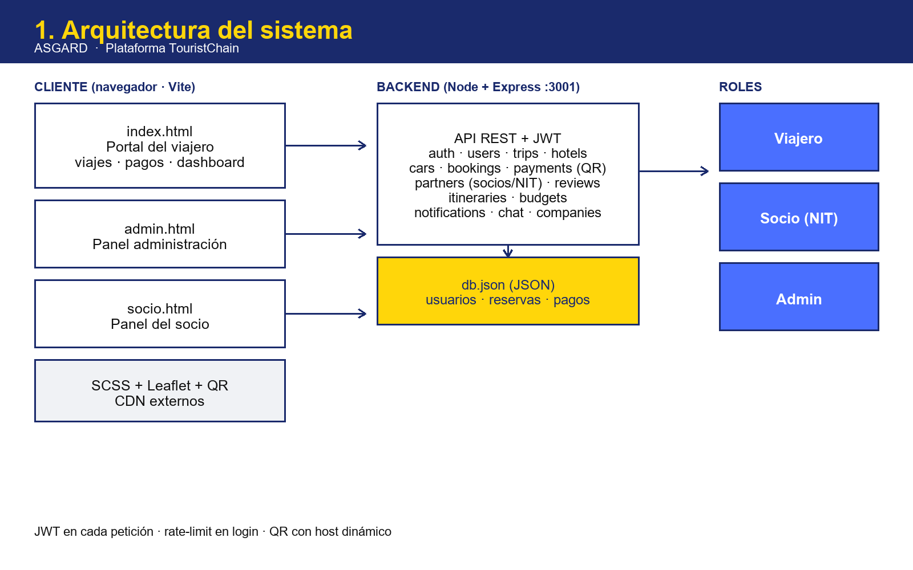
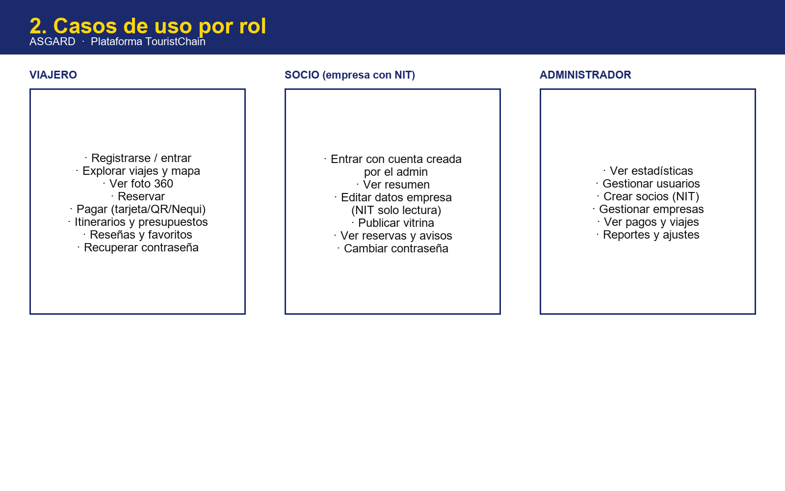
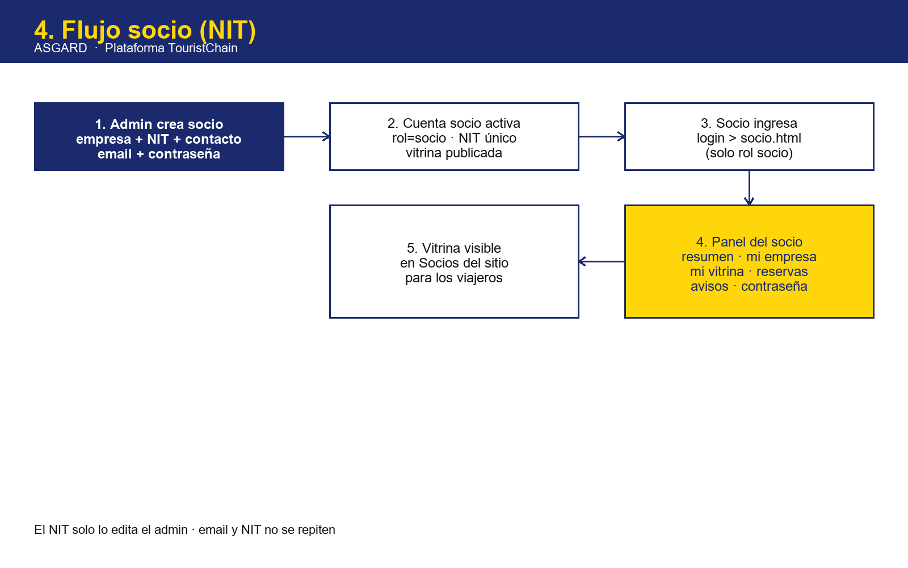
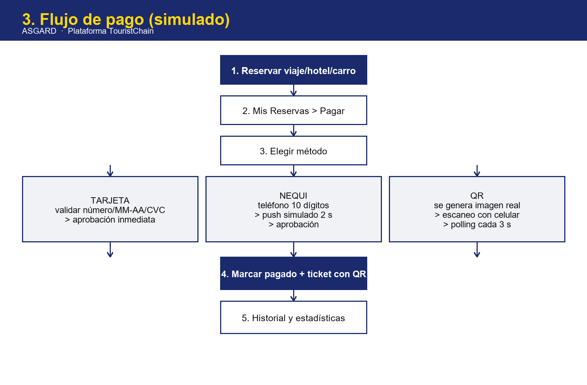
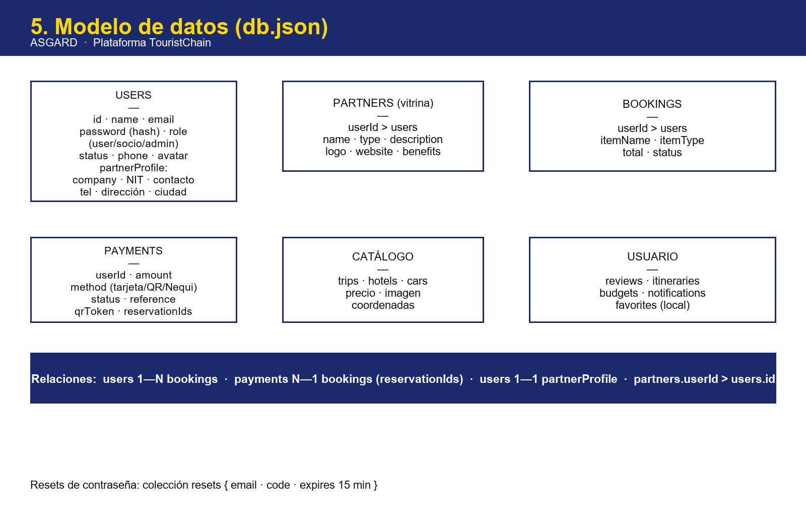

# 2. El producto y sus módulos

## Portal del viajero (`index.html`)

- **Inicio:** hero, características y estadísticas.
- **Viajes:** buscador, filtros de precio/etiqueta, tarjetas con reserva y reseña,
  carrusel de destacados, **mapa de Colombia** (6 spots + hoteles/viajes) y paquetes.
- **Hoteles y Renta:** filtros, **visor foto 360** arrastrable con zoom ("Ver en 3D").
- **Socios y Nosotros:** vitrina de aliados y equipo con carrusel.
- **Contacto, login/registro y recuperación** de contraseña con código de 6 dígitos.
- **Dashboard:** Resumen, Mis Reservas, Pagos, Historial, Favoritos, Itinerarios,
  Presupuestos, Reseñas y Configuración (perfil, avatar y contraseña).
- **Extras:** chatbot IA, notificaciones, modo oscuro, cookies y
  términos + privacidad (Ley 1581 de 2012).

## Panel del socio (`socio.html`)

Resumen, Mi Empresa (NIT de solo lectura), Mi Vitrina (lo que ven los
viajeros), Mis Reservas, Notificaciones y Configuración.

## Panel de administración (`admin.html`)

Dashboard con estadísticas (incluye Socios Activos), Usuarios, Empresas,
**Socios** (crear con NIT, editar, activar/desactivar, eliminar), Pagos,
Viajes, Reportes y Configuración.

## Pagos (simulados)

Tarjeta (validada), Nequi (teléfono colombiano + push simulado) y QR real
generado en el backend, escaneable con el celular; el frontend sondea el
estado cada 3 s. Todo termina en ticket con QR y reservas marcadas como pagadas.

## Datos

Base JSON (`backend/data/db.json`): usuarios con roles y `partnerProfile`
(NIT), catálogo (trips/hotels/cars), bookings, payments, partners,
reviews, itineraries, budgets, notifications y resets de contraseña.
